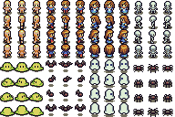

# PIXI.JS GAME
### [Click here to play](https://zanovelloalberto.github.io/PixiRPG/)
### Compile
* write typescritpt code on folder "/src"
* compile typescript running 'npm run build'
* open html file "/res/index" to visualize the contente of the page

# Image of Game

All image both characters and tiles are 16 X 16 

## Tiles

here the tile that can be used to create a JavaScript Object Notation map, 
that should be placed in the _/res/maps/*name_map*.json_ folder.

</img>

### structure of the map

cell placed as base.

tell the game where the player can move.

cell will draw over backgroud.

* cell_height
* cell_width 
* backgroud_layer   
* walk_layer        
* objects_layer     

## Characters
</img>

chracates are already fully implemented, look at [Player](src/Res.ts).ts and [Res.ts](src/game/map/Player.ts) for implementation

