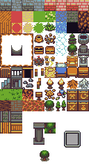

# PIXI.JS ALBERTO GAME
* write typescritpt code on folder "/src"
* compile typescript running 'npm run tscb'
* open html file "/res/index" to visualize the contente of the page


```
PixiRPG
├─ README.md
├─ package.json
├─ res
│  ├─ Maps
│  │  └─ sqare.json
│  ├─ img
│  │  ├─ basictiles.png
│  │  └─ characters.png
│  ├─ index.html
│  └─ js
│     └─ mapCreator.js
├─ src
│  ├─ Loading.ts
│  ├─ Main.ts
│  ├─ Pixi.ts
│  ├─ Res.ts
│  ├─ game
│  │  ├─ Game.ts
│  │  └─ map
│  │     ├─ Map.ts
│  │     ├─ NetPlayer.ts
│  │     ├─ Player.ts
│  │     ├─ Tile.ts
│  │     └─ TileCollector.ts
│  ├─ mainMenu
│  │  ├─ CharChoose.ts
│  │  ├─ LoginBtn.ts
│  │  └─ MainMenu.ts
│  └─ tool
│     └─ Image.ts
└─ tsconfig.json

```


# Founders
* [Alberto Zanovello](https://github.com/ZanovelloAlberto/)

# Contributors
* Bin Hu
* [Gianluca Beltrame](https://github.com/GianlucaBeltrame)
* Riccardo Bragagnolo
* [Nicolò Trinca](https://github.com/nikxtr)


# Image of Game
</img>
</img>
